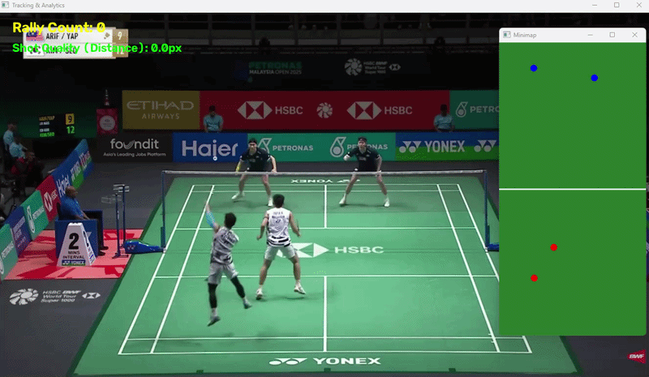

<div align="center">

# 🏸 ShuttleVision: Badminton AI & Tactical Analytics
**Transforming broadcast match footage into 2D tactical intelligence using Computer Vision**

[](https://www.python.org/)
[](https://opencv.org/)
[](https://github.com/ultralytics/ultralytics)
[](https://roboflow.com/)
[](LICENSE)

<p align="center">
  <a href="#-project-demos">Demos</a> •
  <a href="#-key-features">Features</a> •
  <a href="#-system-architecture">Architecture</a> •
  <a href="#-installation--usage">Quickstart</a> •
  <a href="#-roadmap">Roadmap</a>
</p>

</div>

---

## 📽️ Project Demos

<table align="center" width="100%">
  <tr>
    <td width="50%" align="center">
      <b>1️⃣ Homography & 2D Player Mapping</b>
    </td>
    <td width="50%" align="center">
      <b>2️⃣ Shuttle Trajectory & Net Crossing</b>
    </td>
  </tr>
  <tr>
    <td align="center">
      
      <br>
      <i>Transforms broadcast angle to top-down 2D court plane via $H$ matrix.</i>
    </td>
    <td align="center" style="background-color: #1a1a1a; padding: 40px 10px;">
      <br>
      <h3>⏳ Will Be Updated Soon</h3>
      <p><i>YOLOv8 tracking model integration in progress...</i></p>
      <br>
    </td>
  </tr>
  <tr>
    <td colspan="2" align="center">
      <b>3️⃣ Spatial Shot Quality & Tactical Space Evaluation</b>
    </td>
  </tr>
  <tr>
    <td colspan="2" align="center" style="background-color: #1a1a1a; padding: 40px 10px;">
      <br>
      <h3>⏳ Will Be Updated Soon</h3>
      <p><i>Distance metric: $D = \min(\Vert{}P_{\text{shuttle}} - P_{\text{opp1}}\Vert{}, \Vert{}P_{\text{shuttle}} - P_{\text{opp2}}\Vert{})$</i></p>
      <br>
    </td>
  </tr>
</table>

---

## 📌 Key Features

* 📐 **2D Planar Homography**: Dynamically rectifies perspective distortion from high-angle broadcast cameras onto a standardized $13.40\text{ m} \times 6.10\text{ m}$ top-down court.
* 🏃 **Ankle-Keypoint Player Localization**: Leverages `YOLOv8-pose` ankle keypoints to project accurate ground-contact coordinates.
* 🏸 **Custom High-Speed Shuttle Tracker**: Lightweight custom YOLOv8 model trained via Roboflow for fast inference ($\ge 80\text{ FPS}$).
* 📊 **Automated Tactical Insights**: Detects net crossings to segment rallies and quantifies shot execution quality by finding open court space away from defenders.

---

## 🏗️ System Architecture

```text
Broadcast Footage (MP4)
       │
       ├─► 1. Court Calibration ────► Compute Homography Matrix (H)
       │
       ├─► 2. YOLOv8-pose ──────────► Transform Foot Position ──┐
       │                                                         │
       └─► 3. Custom YOLOv8 Detector ─► Shuttle Trajectory       ▼
                                            │              Top-Down Minimap (2D)
                                            ▼                     │
                                     Net Crossing?                │
                                     ├── Yes ─► Rally Count + 1   ▼
                                     └── Land ─► Compute Shot Space Distance (D)
